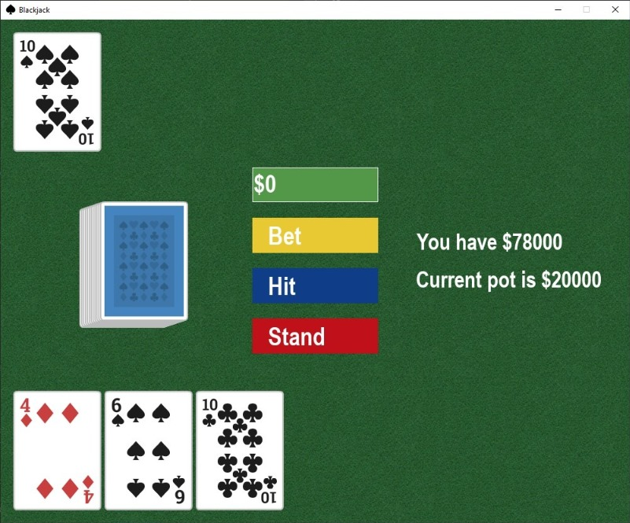

# Blackjack

A simple blackjack game developed using Pygame and a Model-View-Controller Architecture.




### Installation (Windows)

```
git clone https://github.com/confy/blackjack.git
cd blackjack
py -m venv venv
.\venv\Scripts\activate
pip install pygame
py -m blackjack
```
### Sources

Card Sprites: https://opengameart.org/content/boardgame-pack

Music: Miles Davis - Freddie Freeloader